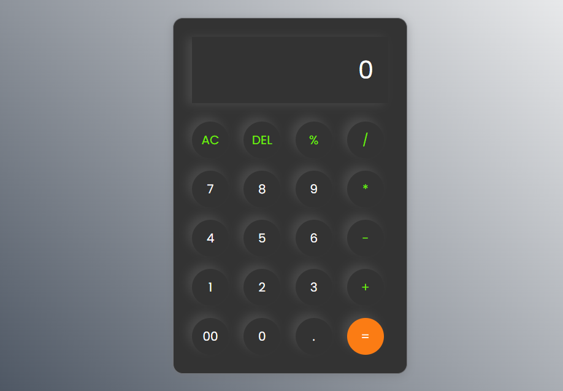

# Calculator-Web-App
# 🧮 Modern Calculator

A modern and responsive Calculator Web Application built with **HTML**, **CSS**, and **JavaScript**. It provides a clean and intuitive user interface for performing everyday arithmetic calculations quickly and efficiently.

---

## 🚀 Features

- ➕ Addition
- ➖ Subtraction
- ✖️ Multiplication
- ➗ Division
- 📊 Percentage Calculation
- 🗑️ AC (Clear All)
- ⌫ DEL (Delete Last Character)
- 🔢 Double Zero (00) Support
- 🔘 Decimal Number Support
- 📱 Responsive Design
- 🎨 Modern Glassmorphism-inspired UI

---

## 🛠️ Technologies Used

- HTML5
- CSS3
- JavaScript (Vanilla JS)

---

## 📂 Project Structure

```
Calculator-Web-App/
│
├── index.html
├── style.css
├── script.js
├── images/
│   └── icon.ico
└── README.md
```

---

## UI of this Application





---

## ▶️ How to Run

1. Clone the repository

```bash
git clone https://github.com/zain-dev-ai-ml/modern-calculator.git
```

2. Open the project folder.

3. Run `index.html` in your browser.

No installation or additional libraries are required.

---

## 🎯 Future Improvements

- Scientific Calculator Functions
- Keyboard Input Support
- Calculation History
- Dark/Light Theme Toggle
- Memory Functions (M+, M-, MR, MC)

---

## 👨‍💻 Author

**Zain Ul Abidin**

GitHub: https://github.com/zain-dev-ai-ml

---

## ⭐ Support

If you found this project helpful, don't forget to **Star ⭐ this repository**.
